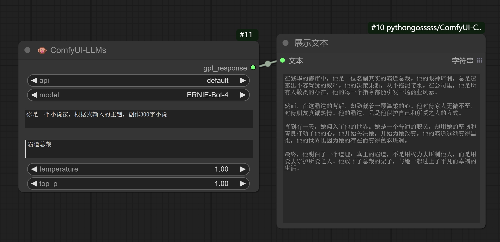
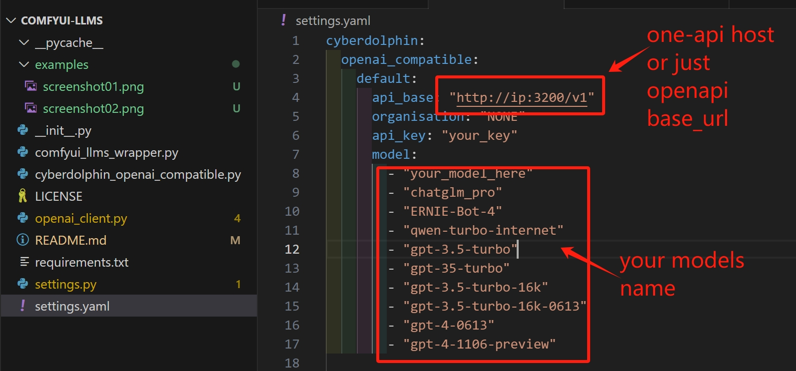

# ComfyUI-LLMs

A minimalist node that calls LLMs, combined with one API, can call all language models, including local models.
一个极简的调用LLMs的节点，结合one-api，可以调用所有语言大模型，包括本地模型。

## Installation

Git clone this repo into the `custom_nodes` folder.
If necessary, check the pip requirements. It will be necessary.

## Settings
The settings are stored in the `settings.yaml` file.

one-api settings: https://github.com/songquanpeng/one-api

### Reference code
Based on the secondary development of the following project, some fields still use the original project.
As a designer, writing code is not easy. If it's helpful, you can contribute together or add a star!
https://github.com/whatbirdisthat/cyberdolphin

## License

GPL 3.