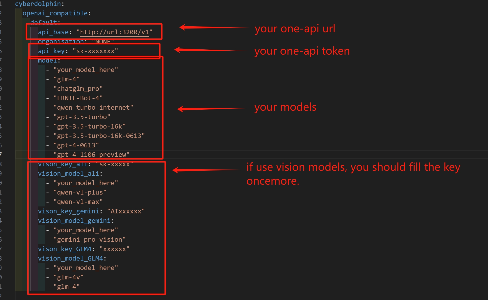
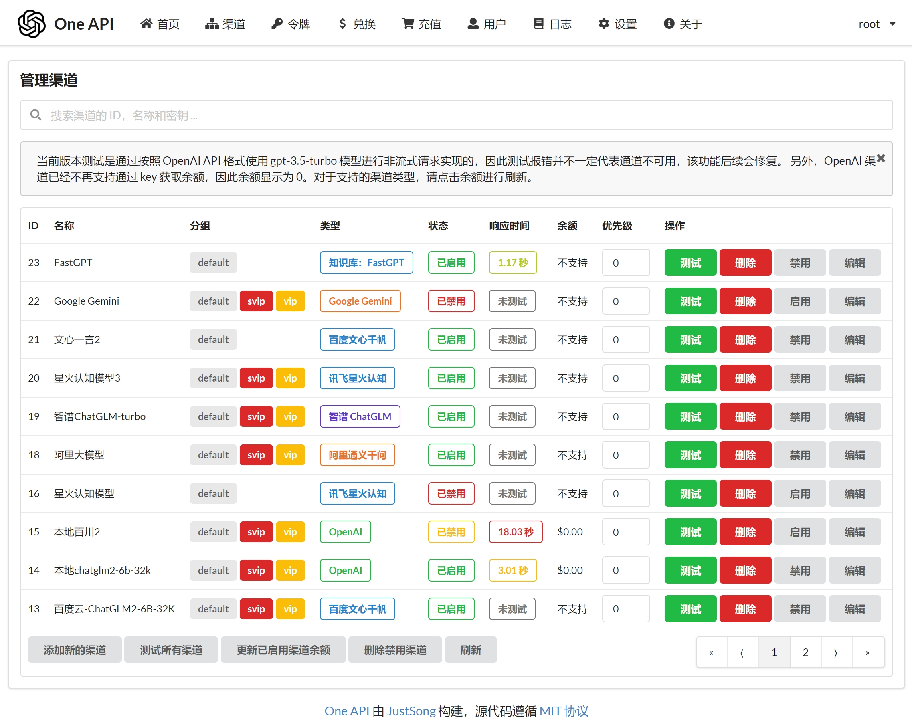

# ComfyUI-LLMs

A minimalist node that calls LLMs, combined with one API, can call all language models, including local models.
一个极简的调用LLMs的节点，结合one-api，可以调用所有语言大模型，包括本地模型。

Supports gemini, glm-4-v, and qwen-v visual models, which can be used to infer cue words.
支持gemini、glm-4-v、qwen-v视觉模型，可以用来反推提示词。

Combined with one API, it supports almost all major language models.
结合one-api，几乎支持所有大语言模型。

## note
To reduce the usage of tokens, by default, the seed remains fixed after each generation. Without changing the prompt words, clicking on generate will not trigger a response.
If you want to generate a new response, you need to change the prompt words.

## Installation

Git clone this repo into the `custom_nodes` folder.
If necessary, check the pip requirements. It will be necessary.

## Settings
The settings are stored in the `settings.yaml` file.

one-api settings: https://github.com/songquanpeng/one-api

### Reference code
Based on the secondary development of the following project, some fields still use the original project.
As a designer, writing code is not easy. If it's helpful, you can contribute together or add a star!
cyberdolphin：https://github.com/whatbirdisthat/cyberdolphin
ComfyUI_GLM4Node：https://github.com/JcandZero/ComfyUI_GLM4Node
ComfyUI-Qwen-VL-API：https://github.com/ZHO-ZHO-ZHO/ComfyUI-Qwen-VL-API

## License

GPL 3.